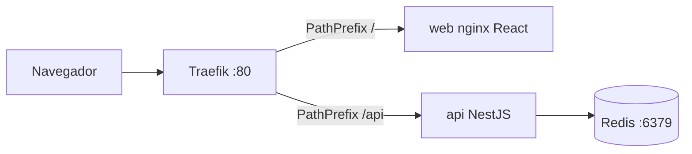

# Guía de coloquio — TP1 DevOps (Sistema de Subastas)

Defensa individual del TP1 UTN FRRe 2026. Basada en la consigna oficial y en el
código de la rama `feature/integracion`.

**Cómo usar este archivo:** leé la cheat sheet, ensayá las demos, y practicá las
respuestas en voz alta (2–5 oraciones). Cuando te pregunten algo que el repo
aún no tiene, usá la sección “Qué falta” — es mejor ser claro que inventar.

---

## 1. Cheat sheet (60 segundos)

**Qué es:** una app de subastas en tiempo real. Se publica un ítem con plazo,
los usuarios pujan, gana el monto más alto al cerrar. Las pujas se ven en vivo
sin refrescar.

**Por qué Redis:** (1) estado compartido entre instancias de la API; (2) pujas
atómicas con un script Lua; (3) Pub/Sub para Socket.IO entre réplicas; (4)
TTL + keyspace events para el cierre automático. La web **nunca** habla con
Redis: solo la API.

**Stack:** Traefik → React/nginx (web) + NestJS (API) → Redis 7. Compose local.
Tests con Vitest. Imágenes multi-stage.

**Levantar todo** (desde `lab1/`):

```bash
docker compose up --build
```

- App: http://localhost/
- Health: http://localhost/api/health
- Traefik dashboard: http://localhost:8080
- Redis expuesto: `localhost:6379` (para `redis-cli` / e2e)

---

## 2. Rúbrica y mapa de puntos

| Ítem | Pts | Qué mostrar / decir | Estado en `feature/integracion` |
|---|---|---|---|
| Apps funcionando (local o nube) | 30 | `compose up`, crear subasta, pujar, ver live | **Listo en local** |
| Visualización de variables en Redis | 10 | `redis-cli`: monto, historial, TTL | **Listo** (demo CLI) |
| GH Actions → publicar en registry | 20 | Workflow build/push a Docker Hub | **Falta** |
| CI: tests unitarios + SAST + badges | 10 | Actions + badge CI + badge SAST en README | **Falta** (hay tests de concurrencia locales) |
| App en servicio externo (desde registry) | 20 | Cloud bajando imagen del Hub, no código fuente | **Falta** |
| Coloquio (individual) | 10 | Explicar arquitectura, demos, decisiones, gaps | Este documento |

**Frase clave de la consigna:** en **local** se pide proxy + 3 réplicas; en
**nube** alcanza **una** instancia funcional bajada del registry. Réplicas en
cloud son opcionales.

**Frase honesta si preguntan por CI/cloud/réplicas:**

> La lógica de la app, Redis y el proxy están armados. Todavía no cerramos el
> pipeline a Docker Hub ni el deploy cloud; en local hoy corre una sola
> instancia de API (el adaptador Redis de Socket.IO ya está preparado para
> cuando escalemos a tres).

---

## 3. Arquitectura



| Servicio | Rol | Puerto interno | Cómo entra el tráfico |
|---|---|---|---|
| `traefik` | Proxy reverso; descubre servicios por labels | 80, 8080 (dashboard) | Entrada única |
| `web` | Build estático Vite servido por nginx | 80 | `/` (prioridad 1) |
| `api` | NestJS, único cliente de Redis | 3000 | `/api` (prioridad 10) |
| `redis` | Estado, Lua, Pub/Sub, TTL | 6379 | Solo red Docker (+ publicado a host para demo) |

**Por qué la web no toca Redis:** la consigna dice que la API es el único
servicio con acceso. La web consume REST + WebSocket contra `/api`. Así se
controla concurrencia, validación y seguridad en un solo lugar.

**Dockerfiles multi-stage:**

- API (`api/Dockerfile`): stage `build` (`npm ci` + compile) → stage `runtime`
  (`npm ci --omit=dev` + `dist`, `USER node`).
- Web (`web/Dockerfile`): build Vite → imagen `nginx:alpine` con el `dist`.

---

## 4. Flujo de una puja (paso a paso)

1. El usuario se identifica con un nombre (localStorage; sin passwords).
2. Crea o abre una subasta → `POST /api/subastas` o `GET /api/subastas/:id`.
3. Al crear, la API guarda en Redis y setea `subasta:{id}:cierre` con `EX` (TTL).
4. El front se suscribe por Socket.IO: `emit('suscribirseASubasta', id)` en path
   `/api/socket.io/`.
5. Al pujar → `POST /api/subastas/:id/pujas` `{ monto, usuario }`.
6. La API ejecuta el script Lua sobre `subasta:{id}:puja`:
   - gana → `200 { ok: true, montoActual }`, append al historial, emite `nuevaPuja`;
   - pierde → `409 { ok: false, motivo: "superada", montoActual }`.
7. Cuando expira el TTL de `:cierre`, Redis publica el evento; `CierreListener`
   marca la subasta cerrada, calcula ganador (última puja del historial) y emite
   `subastaCerrada`.

---

## 5. Preguntas típicas (Q → A)

### Contenedores, Compose y Traefik

**¿Qué es una imagen y qué es un contenedor?**  
La imagen es el paquete inmutable (filesystem + metadata). El contenedor es una
instancia en ejecución de esa imagen. Publicamos imágenes; corremos contenedores.

**¿Por qué Docker Compose?**  
Orquesta Traefik, web, API y Redis con una sola red, healthchecks y labels.
Un comando levanta el escenario local completo.

**¿Qué hace Traefik acá?**  
Proxy reverso con discovery por Docker labels. Enruta `/` a la web y `/api` a
la API sin hardcodear IPs. Si hubiera varias réplicas de `api`, el load balancer
las repartiría solo.

**¿Por qué prioridad 10 en `/api` y 1 en `/`?**  
`PathPrefix(/)` matchea todo. Sin mayor prioridad en `/api`, Traefik podría
mandar `/api/...` a la web. La prioridad más alta gana.

**¿Qué es el healthcheck y el hostname?**  
`GET /api/health` → `{ status: "ok", hostname }`. El hostname es el del
contenedor (`os.hostname()`). Sirve para demostrar qué instancia respondió
cuando hay balanceo.

**¿Multi-stage para qué?**  
La imagen final no lleva toolchain ni `devDependencies`: más chica, más segura,
build reproducible. La API además corre como `USER node` (no root).

---

### Redis

**¿Para qué usan Redis?**  
Almacenar subastas y pujas, garantizar atomicidad en la puja (Lua), propagar
eventos Socket.IO (Pub/Sub) y disparar el cierre con TTL + keyspace events.

**¿La web se conecta a Redis?**  
No. Solo la API (`REDIS_HOST=redis`). Cumple el módulo 2 de la consigna.

**Claves reales del código:**

| Clave | Tipo | Contenido |
|---|---|---|
| `subasta:{id}` | string JSON | datos del ítem, `cerrada`, `ganador` |
| `subasta:{id}:puja` | string número | monto actual (punto de contención) |
| `subasta:{id}:historial` | list | pujas ganadoras en JSON |
| `subasta:{id}:cierre` | string + TTL | dispara el cierre al expirar |
| `subastas:index` | set | IDs para listar sin `KEYS` |

**¿Por qué no usar `KEYS *`?**  
`KEYS` bloquea Redis en producción. El set `subastas:index` permite listar con
`SMEMBERS`.

---

### Concurrencia de pujas (demo principal)

**¿Cuál es el bug de la versión ingenua?**  
Lee el monto (`GET`), espera un rato (`setTimeout` 200 ms en el código), y hace
`SET` sin verificar. Dos clientes pueden leer el mismo monto, ambos “ganar” y
ambos recibir `200`. Endpoint: `POST /api/subastas/:id/pujas/ingenua`.

**¿Cómo lo arreglaron?**  
Script Lua `pujarAtomico` en `pujas.repository.ts`. Redis ejecuta el script de
forma atómica: lee, compara y escribe en un solo paso. Si `nuevo > actual` →
SET y éxito; si no → falla con el monto actual. Ruta normal:
`POST /api/subastas/:id/pujas`.

**¿Por qué Lua y no solo WATCH/MULTI?**  
Ambos sirven. Lua es un round-trip: la lógica vive en Redis y no hay ventana
entre compare y set. WATCH/MULTI también es válido; elegimos Lua por claridad
y menos retries.

**¿Qué responde la API?**  
- Éxito: `200 { ok: true, montoActual }`  
- Superada o cerrada: `409 { ok: false, motivo: "superada"|"cerrada", montoActual }`

---

### Cierre automático

**¿Cómo cierra sola la subasta?**  
Al crear: `SET subasta:{id}:cierre 1 EX <duracionSegundos>`. Redis arranca con
`--notify-keyspace-events Ex`. `CierreListener` se suscribe a
`__keyevent@0__:expired`, parsea el id, marca cerrada, determina ganador y
notifica por WebSocket.

**¿Quién es el ganador?**  
El `usuario` de la última entrada del historial (última puja que ganó). Si no
hubo pujas, `ganador` puede ser `null`.

---

### Tiempo real

**¿WebSockets o SSE?**  
Socket.IO (WebSockets). Path **`/api/socket.io/`** para que Traefik lo mande a
la API (no el default `/socket.io/`).

**Eventos:**  
- Cliente → servidor: `suscribirseASubasta` (id)  
- Servidor → cliente: `nuevaPuja` `{ montoActual, usuario }`, `subastaCerrada` `{ ganador }`

**¿Para qué el adaptador Redis de Socket.IO?**  
Con varias réplicas de API, cada cliente está pegado a una instancia. Sin
Pub/Sub, un evento emitido en la réplica A no llega a clientes de B/C. El
adaptador (`RedisIoAdapter`) replica los emits entre instancias. **Hoy hay una
sola API en compose**; el código ya está preparado para cuando escalemos.

---

### CI/CD, registry y cloud (aunque aún no esté en el repo)

**¿Qué pide la consigna exactamente?**  
1) Publicar imágenes en Docker Hub (u otro registry) con GitHub Actions.  
2) CI con tests unitarios y SAST, con **dos badges** en el README.  
3) Deploy en cloud **bajando la imagen del registry**, no subiendo el código
   fuente para buildear allá.

**¿Cuál sería el flujo correcto?**  
Push a GitHub → Actions corre tests + SAST → build de `web` y `api` → push a
Docker Hub con tags → en Railway/Render/Cloud Run se configura el servicio con
`imagen: usuario/api:tag` (pull), variables `REDIS_*`, y una instancia de Redis
(o Redis managed). Local sigue siendo `compose` con Traefik + réplicas.

**¿Por qué “desde el registry” y no desde el repo en la nube?**  
Demuestra el ciclo imagen → registry → runtime. El artefacto desplegado es la
misma imagen que CI construyó y testeó, no un build ad-hoc en el PaaS.

**¿Qué tests tienen hoy?**  
- Unit scaffold (`app.controller.spec.ts`).  
- E2E de concurrencia (`pujas-concurrencia.e2e-spec.ts`): atómica → un 200 y un
  409; ingenua → dos 200. Necesitan Redis en `localhost:6379`.

**¿Qué es SAST?**  
Static Application Security Testing: analiza el código en busca de patrones
inseguros (Semgrep o SonarCloud) sin ejecutar la app. El badge muestra el
resultado del análisis.

---

## 6. Guion de demos (ensayar dos veces)

### Demo A — Levantar el stack

```bash
cd lab1
docker compose up --build
```

Abrir http://localhost/ → identificar usuario → crear subasta corta → pujar.

### Demo B — Redis por dentro (10 puntos)

```bash
docker compose exec redis redis-cli
```

Dentro de `redis-cli` (reemplazar `<id>`):

```text
SMEMBERS subastas:index
GET subasta:<id>
GET subasta:<id>:puja
LRANGE subasta:<id>:historial 0 -1
TTL subasta:<id>:cierre
```

Crear una subasta de 15 s para ver el TTL bajar y el cierre:

```bash
curl -X POST http://localhost/api/subastas ^
  -H "Content-Type: application/json" ^
  -d "{\"nombre\":\"Demo TTL\",\"montoInicial\":100,\"duracionSegundos\":15}"
```

(En bash/Linux usar `\` en lugar de `^`.)

Narración: “Acá está el monto actual, el historial de pujas, y el TTL de la
clave de cierre. Cuando llega a -2/-1, la subasta queda cerrada en Redis.”

### Demo C — Pujas concurrentes (antes / después)

1. Crear subasta. Anotar el `id`.
2. **Ingenua** (dos terminales, mismo monto, casi a la vez):

```bash
curl -X POST http://localhost/api/subastas/<id>/pujas/ingenua -H "Content-Type: application/json" -d "{\"monto\":200,\"usuario\":\"ana\"}"
curl -X POST http://localhost/api/subastas/<id>/pujas/ingenua -H "Content-Type: application/json" -d "{\"monto\":200,\"usuario\":\"bob\"}"
```

Esperado: **ambos** pueden devolver `ok: true` (bug).

3. Nueva subasta. **Atómica**:

```bash
curl -X POST http://localhost/api/subastas/<id>/pujas -H "Content-Type: application/json" -d "{\"monto\":200,\"usuario\":\"ana\"}"
curl -X POST http://localhost/api/subastas/<id>/pujas -H "Content-Type: application/json" -d "{\"monto\":200,\"usuario\":\"bob\"}"
```

Esperado: uno `200 ok:true`, el otro `409 motivo:superada`.

En la UI hay toggle ingenua/corregida en el detalle de la subasta.

### Demo D — Balanceo / tolerancia (estado actual vs objetivo)

**Hoy:** una sola instancia `api`. `curl http://localhost/api/health` siempre
devuelve el mismo `hostname`.

**Cuando existan 3 réplicas** (lo que pide la consigna en local):

```bash
# ejemplo conceptual — aún no está en compose
docker compose up --scale api=3
curl http://localhost/api/health   # repetir: hostnames distintos
docker stop <un-contenedor-api>
curl http://localhost/api/health   # sigue respondiendo
```

Si preguntan: “El health ya expone hostname; falta escalar el servicio `api` a
3 réplicas detrás de Traefik para completar esa demo.”

---

## 7. Decisiones técnicas (justificación corta)

| Decisión | Por qué |
|---|---|
| NestJS + TypeScript | Módulos, DI, fácil de testear y de crecer (health, subastas, realtime). |
| React + Vite + nginx | Front estático en imagen chica; Traefik solo sirve archivos. |
| Redis (no Postgres) | Consigna + memoria + Lua atómico + Pub/Sub + TTL. |
| Traefik | Discovery por labels; escala sin reescribir nginx.conf. |
| Lua para pujas | Atomicidad en Redis; demo clara vs ruta ingenua. |
| Socket.IO + Redis adapter | Live updates; listo para multi-réplica. |
| Path `/api/socket.io/` | Misma regla Traefik que el REST. |
| Sin auth con passwords | Fuera de alcance; nombre alcanza para el TP. |

---

## 8. Limitaciones y mejoras (decirlas vos)

**Hecho en esta rama:** CRUD de subastas, puja atómica + ingenua, cierre TTL,
Socket.IO, front integrado, Compose con Traefik/web/api/redis, test e2e de
concurrencia.

**Falta respecto a la consigna / rúbrica:**

1. 3 réplicas de API en local + demo de balanceo y `docker stop`.
2. GitHub Actions: tests + SAST + build/push a Docker Hub.
3. Badges de CI y de seguridad en el README.
4. Deploy cloud tirando de la imagen del registry (1 instancia alcanza).
5. README de proyecto con diagrama + informe/presentación de resultados.

**Posibles mejoras futuras (si sobra tiempo o te preguntan “qué harían”):**

- Sticky sessions o cuidado extra con WebSockets detrás del LB.
- Más tests unitarios de repositorios y del listener de cierre.
- Semgrep/Sonar en CI con badge.
- Compose override para “prod-like” pull de imágenes del Hub en local.

---

## 9. Contrato API (para no trabarte)

```
POST /api/subastas                  { nombre, montoInicial, duracionSegundos }
GET  /api/subastas
GET  /api/subastas/:id
POST /api/subastas/:id/pujas        { monto, usuario }
POST /api/subastas/:id/pujas/ingenua   ← solo demo
GET  /api/health                    { status, hostname }
```

WebSocket path: `/api/socket.io/`  
Eventos: `suscribirseASubasta` → `nuevaPuja` / `subastaCerrada`.

---

## 10. Checklist pre-coloquio

- [ ] `docker compose up --build` funciona en tu máquina
- [ ] Demo Redis CLI ensayada (monto, historial, TTL)
- [ ] Demo ingenua vs atómica ensayada (dos curls o toggle UI)
- [ ] Sabés explicar por qué solo la API habla con Redis
- [ ] Sabés explicar Lua vs ingenua en una frase
- [ ] Sabés explicar Traefik `/` vs `/api`
- [ ] Tenés lista la frase honesta sobre CI / Hub / cloud / 3 réplicas
- [ ] Repo de GitHub a mano (enlace del grupo)
- [ ] Commits del grupo visibles en el historial (el historial se mira)

---

## Fuentes

- Consigna: `TP1-AppWebRedisContenerizados-DevOps-UTN-2026.pdf`
- Contexto del equipo: [`AGENTS.md`](./AGENTS.md), [`PLAN.md`](./PLAN.md)
- Código clave: `docker-compose.yml`, `api/src/subastas/pujas.repository.ts`,
  `api/src/subastas/cierre.listener.ts`, `api/src/realtime/`, `api/src/health/`
