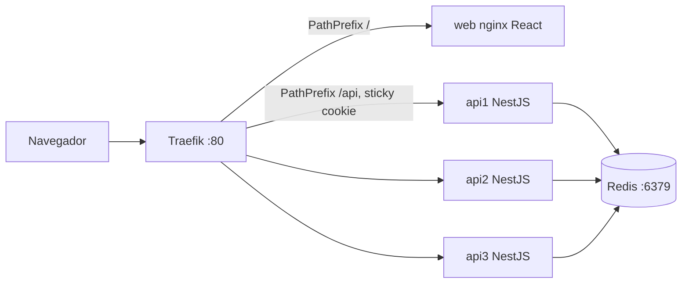

# Guía de coloquio — TP1 DevOps (Sistema de Subastas)

Defensa individual del TP1 UTN FRRe 2026. El proyecto está **completo y
mergeado a `main`**: las 10 fases del `PLAN.md` están hechas, verificadas
en local y desplegadas en Railway.

**Cómo usar este archivo:** primero leé la sección 3 ("Cómo armar la
exposición"), que te da el orden y los tiempos. Después ensayá las demos
de la sección 7 dos veces, y repasá las preguntas de la sección 6 en voz
alta (2–5 oraciones cada respuesta). El coloquio es individual: tenés que
poder explicar el proyecto entero, no solo la parte que programaste vos.

---

## 1. Cheat sheet (60 segundos)

**Qué es:** una app de subastas en tiempo real. Se publica un ítem con
plazo, los usuarios pujan, gana el monto más alto al cerrar. Las pujas se
ven en vivo sin refrescar.

**Por qué Redis:** (1) estado compartido entre las 3 instancias de la API;
(2) pujas atómicas con un script Lua; (3) Pub/Sub para Socket.IO entre
réplicas; (4) TTL + keyspace events para el cierre automático. La web
**nunca** habla con Redis: solo la API.

**Stack:** Traefik → React/nginx (web) + NestJS x3 (api) → Redis 7.
Docker Compose en local, Railway en la nube. Tests con Vitest + Supertest.
Imágenes multi-stage, publicadas a Docker Hub por GitHub Actions.

**Levantar todo en local** (desde `lab1/`):

```bash
docker compose up --build
```

- App: http://localhost/
- Health: http://localhost/api/health
- Traefik dashboard: http://localhost:8080
- Redis expuesto: `localhost:6379` (para `redis-cli` / tests e2e)

**En la nube:** desplegado en Railway (una instancia de cada servicio —
`web`, `api`, `redis` — bajando las imágenes ya publicadas en Docker Hub,
sin buildear código ahí). Llevá la URL a mano el día del coloquio como
plan B por si el WiFi del aula falla con el local.

---

## 2. Rúbrica y mapa de puntos

| Ítem | Pts | Qué mostrar | Estado |
|---|---|---|---|
| Apps funcionando (local o nube) | 30 | `compose up`, crear subasta, pujar, ver en vivo | ✅ Local y en Railway |
| Visualización de variables en Redis | 10 | `redis-cli`: monto, historial, TTL | ✅ Demo B |
| GH Actions → publicar en registry | 20 | Workflow build/push a Docker Hub | ✅ `subastas-api` / `subastas-web` |
| CI: tests unitarios + SAST + badges | 10 | Actions + badge CI + badge SAST en README | ✅ 15 tests e2e + Semgrep |
| App en servicio externo (desde registry) | 20 | Cloud bajando imagen del Hub, no código fuente | ✅ Railway |
| Coloquio (individual) | 10 | Explicar arquitectura, demos, decisiones | Depende de tu ensayo |

**Frase clave de la consigna** (por si preguntan por qué no hay 3 réplicas
en Railway): en **local** se pide proxy + 3 réplicas; en **nube** alcanza
con **una** instancia funcional bajada del registry. Réplicas en cloud son
mejora opcional, no requisito — está confirmado en la consigna oficial.

Los 90 puntos grupales están cubiertos. Lo único que depende de vos ahora
es el coloquio.

---

## 3. Cómo armar la exposición (guion con tiempos)

Pensado para ~12-15 minutos de exposición + preguntas. Ajustá los tiempos
según lo que te den, pero mantené el orden: arrancar por el problema y la
arquitectura antes de tocar código, y dejar la demo de concurrencia (el
corazón del proyecto) como el punto más fuerte, no al final apurado.

| # | Bloque | Tiempo | Qué hacés |
|---|---|---|---|
| 1 | Intro | 1 min | Cheat sheet (sección 1): qué es, por qué existe, por qué Redis. Sin código todavía. |
| 2 | Arquitectura | 2 min | Mostrar el diagrama (sección 4) y nombrar las 4 piezas y por qué la web no toca Redis. |
| 3 | Demo A — levantar el stack | 2 min | `docker compose up`, abrir la app, identificarte con un nombre, crear una subasta. |
| 4 | Demo C — concurrencia (plato fuerte) | 3 min | Versión ingenua (ganan los dos) vs. atómica (gana uno). Explicá el script Lua mientras se ve. |
| 5 | Demo B — Redis por dentro | 2 min | `redis-cli`: monto, historial, TTL bajando. Son 10 puntos directos, no la apures. |
| 6 | Demo D — balanceo y tolerancia | 2 min | Hostnames distintos en `/api/health`, `docker stop` a una réplica, seguís pudiendo usar la app. |
| 7 | Pipeline y cloud | 2 min | Mostrar el badge verde de CI/SAST en GitHub, el Actions corriendo, las imágenes en Docker Hub, y la URL de Railway funcionando. |
| 8 | Cierre | 1 min | Una decisión técnica que justifiques bien (ej. Lua vs WATCH/MULTI) y una dificultad real que resolviste (sección 8). |
| — | Preguntas | resto | Usá la sección 6. Si no sabés algo, decilo — es mejor que inventar. |

**Tips concretos:**

- Practicá la transición entre demos sin perder tiempo buscando comandos:
  tené los `curl` de la sección 7 en un archivo de texto aparte, listos
  para copiar/pegar.
- Si te preguntan por tu módulo específico primero, está bien, pero
  volvé a completar el resto del recorrido — la nota es individual y
  evalúa que entiendas el proyecto entero, no solo tu parte.
- Sacá una captura de pantalla de la app funcionando en Railway y de los
  workflows en verde en GitHub *antes* del coloquio, por si el proyector
  no tiene wifi o Railway está lento ese día.
- No repitas de memoria: contá el flujo con tus palabras apoyándote en lo
  que se ve en pantalla. Se nota cuando alguien entiende vs. cuando
  recita.

---

## 4. Arquitectura



| Servicio | Rol | Puerto interno | Cómo entra el tráfico |
|---|---|---|---|
| `traefik` | Proxy reverso; descubre servicios por labels | 80, 8080 (dashboard) | Entrada única |
| `web` | Build estático Vite servido por nginx | 80 | `/` (prioridad 1) |
| `api1/api2/api3` | NestJS, único cliente de Redis, 3 instancias idénticas | 3000 | `/api` (prioridad 10), sticky cookie `api_sticky` |
| `redis` | Estado, Lua, Pub/Sub, TTL | 6379 | Solo red Docker (+ publicado a host para demo/tests) |

**En la nube (Railway):** misma idea pero sin Traefik — cada servicio
(`web`, `api`, `redis`) es un contenedor Railway; `web` corre nginx con
una plantilla que reenvía `/api/*` a la API por la red **privada** interna
de Railway (`api.railway.internal:3000`), así el código de React que usa
rutas relativas (`fetch('/api/...')`) funciona igual sin cambios.

**Por qué la web no toca Redis:** la consigna dice que la API es el único
servicio con acceso. La web consume REST + WebSocket contra `/api`. Así se
controla concurrencia, validación y seguridad en un solo lugar.

**Dockerfiles multi-stage:**

- API (`api/Dockerfile`): stage `build` (`npm ci` + compile) → stage
  `runtime` (`npm ci --omit=dev` + `dist`, `USER node`).
- Web (`web/Dockerfile`): build Vite → imagen `nginx:alpine` con el `dist`
  y una plantilla de config (`nginx.conf.template`) para el proxy a `/api`.

---

## 5. Flujo de una puja (paso a paso)

1. El usuario se identifica con un nombre (localStorage; sin passwords).
2. Crea o abre una subasta → `POST /api/subastas` o `GET /api/subastas/:id`.
3. Al crear, la API guarda en Redis y setea `subasta:{id}:cierre` con `EX` (TTL).
4. El front se suscribe por Socket.IO: `emit('suscribirseASubasta', id)` en path
   `/api/socket.io/`.
5. Al pujar → `POST /api/subastas/:id/pujas` `{ monto, usuario }`.
6. La API ejecuta el script Lua sobre `subasta:{id}:puja`:
   - gana → `200 { ok: true, montoActual }`, append al historial, emite `nuevaPuja`;
   - pierde → `409 { ok: false, motivo: "superada", montoActual }`.
7. Cuando expira el TTL de `:cierre`, Redis publica el evento; `CierreListener`
   marca la subasta cerrada, calcula ganador (última puja del historial) y emite
   `subastaCerrada`.

---

## 6. Preguntas típicas (Q → A)

### Contenedores, Compose y Traefik

**¿Qué es una imagen y qué es un contenedor?**
La imagen es el paquete inmutable (filesystem + metadata). El contenedor es una
instancia en ejecución de esa imagen. Publicamos imágenes; corremos contenedores.

**¿Por qué Docker Compose?**
Orquesta Traefik, web, las 3 API y Redis con una sola red, healthchecks y
labels. Un comando levanta el escenario local completo.

**¿Qué hace Traefik acá?**
Proxy reverso con discovery por Docker labels. Enruta `/` a la web y `/api` a
las API sin hardcodear IPs, y balancea entre las 3 réplicas automáticamente.

**¿Por qué prioridad 10 en `/api` y 1 en `/`?**
`PathPrefix(/)` matchea todo. Sin mayor prioridad en `/api`, Traefik podría
mandar `/api/...` a la web. La prioridad más alta gana.

**¿Qué es el healthcheck y el hostname?**
`GET /api/health` → `{ status: "ok", hostname }`. El hostname es el del
contenedor (`os.hostname()`). Sirve para demostrar qué instancia respondió
cuando hay balanceo.

**¿Multi-stage para qué?**
La imagen final no lleva toolchain ni `devDependencies`: más chica, más segura,
build reproducible. La API además corre como `USER node` (no root).

---

### Redis

**¿Para qué usan Redis?**
Almacenar subastas y pujas, garantizar atomicidad en la puja (Lua), propagar
eventos Socket.IO (Pub/Sub) y disparar el cierre con TTL + keyspace events.

**¿La web se conecta a Redis?**
No. Solo la API (`REDIS_HOST=redis`). Cumple el módulo 2 de la consigna.

**Claves reales del código:**

| Clave | Tipo | Contenido |
|---|---|---|
| `subasta:{id}` | string JSON | datos del ítem, `cerrada`, `ganador` |
| `subasta:{id}:puja` | string número | monto actual (punto de contención) |
| `subasta:{id}:historial` | list | pujas ganadoras en JSON |
| `subasta:{id}:cierre` | string + TTL | dispara el cierre al expirar |
| `subastas:index` | set | IDs para listar sin `KEYS` |

**¿Por qué no usar `KEYS *`?**
`KEYS` bloquea Redis en producción. El set `subastas:index` permite listar con
`SMEMBERS`.

---

### Concurrencia de pujas (demo principal)

**¿Cuál es el bug de la versión ingenua?**
Lee el monto (`GET`), espera un rato (`setTimeout` 200 ms en el código), y hace
`SET` sin verificar. Dos clientes pueden leer el mismo monto, ambos "ganar" y
ambos recibir `200`. Endpoint: `POST /api/subastas/:id/pujas/ingenua`.

**¿Cómo lo arreglaron?**
Script Lua `pujarAtomico` en `pujas.repository.ts`. Redis ejecuta el script de
forma atómica: lee, compara y escribe en un solo paso. Si `nuevo > actual` →
SET y éxito; si no → falla con el monto actual. Ruta normal:
`POST /api/subastas/:id/pujas`.

**¿Por qué Lua y no solo WATCH/MULTI?**
Ambos sirven. Lua es un round-trip: la lógica vive en Redis y no hay ventana
entre compare y set. WATCH/MULTI también es válido; elegimos Lua por claridad
y menos retries.

**¿Qué responde la API?**
- Éxito: `200 { ok: true, montoActual }`
- Superada o cerrada: `409 { ok: false, motivo: "superada"|"cerrada", montoActual }`

---

### Cierre automático

**¿Cómo cierra sola la subasta?**
Al crear: `SET subasta:{id}:cierre 1 EX <duracionSegundos>`. Redis arranca con
`--notify-keyspace-events Ex`. `CierreListener` se suscribe a
`__keyevent@0__:expired`, parsea el id, marca cerrada, determina ganador y
notifica por WebSocket.

**¿Quién es el ganador?**
El `usuario` de la última entrada del historial (última puja que ganó). Si no
hubo pujas, `ganador` puede ser `null`.

**¿Qué pasa con 3 réplicas escuchando el mismo evento?**
Las 3 API están suscriptas al mismo canal de Redis, así que las 3 reciben el
evento de expiración. Hay un lock (`SET ... NX`) para que solo una lo procese
y no se pisen marcando el cierre en simultáneo.

---

### Tiempo real

**¿WebSockets o SSE?**
Socket.IO (WebSockets). Path **`/api/socket.io/`** para que Traefik lo mande a
la API (no el default `/socket.io/`).

**Eventos:**
- Cliente → servidor: `suscribirseASubasta` (id)
- Servidor → cliente: `nuevaPuja` `{ montoActual, usuario }`, `subastaCerrada` `{ ganador }`

**¿Para qué el adaptador Redis de Socket.IO?**
Con 3 réplicas de API, cada cliente está pegado a una instancia (sticky
cookie). Sin Pub/Sub, un evento emitido en la réplica A no llegaría a
clientes conectados a B o C. El adaptador (`RedisIoAdapter`) replica los
emits entre instancias vía Redis.

---

### CI/CD, registry y cloud

**¿Qué pide la consigna exactamente?**
1) Publicar imágenes en Docker Hub (u otro registry) con GitHub Actions.
2) CI con tests unitarios y SAST, con **dos badges** en el README.
3) Deploy en cloud **bajando la imagen del registry**, no subiendo el código
   fuente para buildear allá.

**¿Cuál es el flujo real, hoy funcionando?**
Push a GitHub → Actions levanta un Redis de servicio → corre tests unitarios
y los 15 tests e2e → corre Semgrep (SAST) → si todo pasa, build de `web` y
`api` → push a Docker Hub con tags `latest` y el SHA del commit. En Railway,
cada servicio (`web`, `api`, `redis`) está configurado para bajar esa imagen
del Hub, no para buildear desde el repo.

**¿Qué tests corren?**
15 tests e2e con Supertest sobre una instancia real de Nest + Redis:
health, CRUD de subastas (crear/listar/detalle, con sus 400/404), pujas
(éxito, superada, validaciones, 404), concurrencia (atómica vs ingenua) y
cierre automático (con y sin pujas, esperando el TTL real — no se puede
mockear porque depende de un evento real de Redis).

**¿Qué es SAST?**
Static Application Security Testing: analiza el código en busca de patrones
inseguros (Semgrep) sin ejecutar la app. El badge muestra el resultado del
análisis.

---

## 7. Guion de demos (ensayar dos veces)

### Demo A — Levantar el stack

```bash
cd lab1
docker compose up --build
```

Abrir http://localhost/ → identificar usuario → crear subasta corta → pujar.

### Demo B — Redis por dentro (10 puntos)

```bash
docker compose exec redis redis-cli
```

Dentro de `redis-cli` (reemplazar `<id>`):

```text
SMEMBERS subastas:index
GET subasta:<id>
GET subasta:<id>:puja
LRANGE subasta:<id>:historial 0 -1
TTL subasta:<id>:cierre
```

Crear una subasta de 15 s para ver el TTL bajar y el cierre:

```bash
curl -X POST http://localhost/api/subastas \
  -H "Content-Type: application/json" \
  -d '{"nombre":"Demo TTL","montoInicial":100,"duracionSegundos":15}'
```

Narración: "Acá está el monto actual, el historial de pujas, y el TTL de la
clave de cierre. Cuando llega a -2/-1, la subasta queda cerrada en Redis."

### Demo C — Pujas concurrentes (antes / después)

1. Crear subasta. Anotar el `id`.
2. **Ingenua** (dos terminales, mismo monto, casi a la vez):

```bash
curl -X POST http://localhost/api/subastas/<id>/pujas/ingenua -H "Content-Type: application/json" -d '{"monto":200,"usuario":"ana"}'
curl -X POST http://localhost/api/subastas/<id>/pujas/ingenua -H "Content-Type: application/json" -d '{"monto":200,"usuario":"bob"}'
```

Esperado: **ambos** pueden devolver `ok: true` (bug a propósito).

3. Nueva subasta. **Atómica**:

```bash
curl -X POST http://localhost/api/subastas/<id>/pujas -H "Content-Type: application/json" -d '{"monto":200,"usuario":"ana"}'
curl -X POST http://localhost/api/subastas/<id>/pujas -H "Content-Type: application/json" -d '{"monto":200,"usuario":"bob"}'
```

Esperado: uno `200 ok:true`, el otro `409 motivo:superada`.

En la UI hay un toggle ingenua/corregida en el detalle de la subasta —
también sirve para hacer esta demo sin terminal.

### Demo D — Balanceo y tolerancia a fallos

Las 3 réplicas (`api1`, `api2`, `api3`) ya están en `docker-compose.yml`,
detrás de Traefik con sticky cookie.

**Por terminal** (dos ventanas o una sola, en secuencia):

```bash
curl http://localhost/api/health   # repetir varias veces: hostnames distintos
docker stop lab1-api2-1            # apagar una réplica a propósito
curl http://localhost/api/health   # sigue respondiendo (con las otras 2)
docker start lab1-api2-1           # levantarla de nuevo
```

**En la UI:** el botón "Probar balanceo" (franja de estado, arriba de
todo) hace exactamente ese mismo `GET /api/health` y actualiza el
hostname en pantalla. Para "apagar una réplica" no hay botón —
intencionalmente, no tendría sentido exponer eso a un usuario final—, esa
parte de la demo siempre se hace por terminal con `docker stop`.

**Un detalle técnico para lucirse si preguntan por qué el botón "sabía"
mostrar hostnames distintos:** Traefik usa una *sticky cookie*
(`api_sticky`) para que una conexión de WebSocket no salte de réplica a
mitad de sesión. Esa cookie aplica a todo `/api`, así que un `curl` sin
guardar cookies rota solo entre las 3 réplicas en cada llamada — pero un
navegador normal, que sí persiste cookies, quedaría pegado a la misma
réplica después del primer click. Por eso el chequeo de salud del
frontend pide esa llamada puntual con `credentials: 'omit'` (no manda ni
guarda esa cookie), para que el botón se comporte igual que `curl` y siga
rotando. Es una buena anécdota de "dificultad encontrada" si te preguntan
por decisiones de frontend.

Si preguntan por qué sticky cookie *además* del adaptador de Redis para
Socket.IO: la cookie evita que una conexión de WebSocket salte de réplica
a mitad de sesión; el adaptador de Redis es lo que garantiza que el
mensaje llegue igual aunque el cliente termine en otra réplica.

### Demo E — La app en la nube

Abrir la URL pública de Railway (`web`) y repetir la Demo A ahí (crear
subasta, pujar). Sirve como respaldo si el proyector no tiene red para
levantar Docker en vivo, y como prueba de que el requisito de "app
funcionando en servicio externo, bajando la imagen del registry" está
cumplido de verdad.

---

## 8. Decisiones técnicas y dificultades reales resueltas

Esto es material directo para la parte de "resultados, dificultades y
mejoras" — contalo con confianza, encontrar y resolver estos problemas es
tan parte del trabajo como escribir el código que anduvo a la primera.

| Decisión | Por qué |
|---|---|
| NestJS + TypeScript | Módulos, DI, fácil de testear y de crecer (health, subastas, realtime). |
| React + Vite + nginx | Front estático en imagen chica; nginx además hace de proxy a `/api` en la nube. |
| Redis (no Postgres) | Consigna + memoria compartida + Lua atómico + Pub/Sub + TTL. |
| Traefik | Discovery por labels; escala a 3 réplicas sin reescribir configuración. |
| Lua para pujas | Atomicidad real en Redis; permite comparar la ruta ingenua vs la corregida. |
| Socket.IO + Redis adapter | Live updates que funcionan igual con 1 o con 3 réplicas. |
| Path `/api/socket.io/` | Misma regla de Traefik que el REST, un solo punto de entrada. |
| Proxy de `/api` en el propio nginx de `web` | Evita CORS y evita tocar código de React para el deploy en la nube: el fetch relativo sigue funcionando igual. |
| Sin auth con passwords | Fuera de alcance de la consigna; un nombre alcanza para el TP. |

**Dificultades reales encontradas (con la solución):**

1. **Healthcheck fallaba en Docker.** `wget http://localhost:3000/...`
   fallaba porque dentro del contenedor `localhost` resuelve primero a
   `::1` (IPv6) y el server de Nest solo escucha en IPv4. Se cambió a
   `127.0.0.1`.
2. **Listar sin `KEYS`.** Se agregó un set `subastas:index` con los IDs,
   en vez de escanear todo el keyspace (mala práctica en Redis real).
3. **CI corriendo, pero no probando nada de verdad.** `npm test` solo
   matcheaba archivos `*.spec.ts`; todos los tests reales del proyecto
   eran `*.e2e-spec.ts` (incluido el de concurrencia). El CI los estaba
   ignorando en silencio. Se corrigió el job para correr también
   `npm run test:e2e`, con un servicio de Redis agregado al workflow.
4. **Railway devolvía "Application failed to respond".** El puerto de
   destino configurado para el dominio público de `web` no coincidía con
   el 80 real de nginx.
5. **nginx no arrancaba en la nube** (`host not found in resolver`). El
   resolver DNS estaba hardcodeado a `127.0.0.11` (el DNS interno de
   Docker Compose), que no existe fuera de ese entorno. Se resolvió
   usando `NGINX_LOCAL_RESOLVERS`, una función de la propia imagen
   oficial de nginx que autodetecta el resolver correcto leyendo
   `/etc/resolv.conf` del contenedor.
6. **Conexión rechazada al dominio público de la propia API** (`Address
   not available`, "hairpin"). Conectarse desde un contenedor a su propia
   IP pública, dentro de la misma nube, suele estar bloqueado. Se
   resolvió usando la red **privada** de Railway
   (`api.railway.internal:3000`) en vez del dominio público.
7. **El monto no se actualizaba solo en la pantalla.** El cliente de
   WebSocket intentaba suscribirse a la sala de la subasta en un efecto
   que podía correr antes de que terminara de conectar el socket, y
   nunca reintentaba. Se arregló re-suscribiendo en cada evento
   `connect` (con un ref para tener siempre el id más reciente).
8. **El botón "Probar balanceo" siempre mostraba el mismo hostname.** La
   sticky cookie de Traefik (necesaria para que el WebSocket no salte de
   réplica) aplica a todo `/api`, así que un navegador normal quedaba
   pegado a la misma réplica después del primer click. Se resolvió
   pidiendo ese chequeo puntual con `credentials: 'omit'`, para que esa
   llamada no mande ni reciba la cookie y vuelva a repartirse round-robin
   en cada click, igual que un `curl` suelto.

**Posibles mejoras futuras (si preguntan "qué harían distinto"):**

- Tests unitarios aislados (con mocks) de los repositorios, además de los
  e2e contra Redis real.
- Réplicas también en la nube (mejora opcional según la consigna).
- Un panel de administración para cerrar/cancelar subastas manualmente.
- Migrar la config de nginx a algo más declarativo si el número de rutas
  crece (hoy un solo `location /api/` alcanza).

---

## 9. Contrato API

```
POST /api/subastas                     { nombre, montoInicial, duracionSegundos }
GET  /api/subastas
GET  /api/subastas/:id
POST /api/subastas/:id/pujas           { monto, usuario }
POST /api/subastas/:id/pujas/ingenua   ← solo demo, no forma parte del contrato "oficial"
GET  /api/health                       { status, hostname }
```

WebSocket path: `/api/socket.io/`
Eventos: `suscribirseASubasta` → `nuevaPuja` / `subastaCerrada`.

---

## 10. Checklist pre-coloquio

- [ ] `docker compose up --build` funciona en tu máquina
- [ ] Sabés la URL de Railway de memoria (o la tenés guardada a mano)
- [ ] Demo Redis CLI ensayada (monto, historial, TTL)
- [ ] Demo ingenua vs atómica ensayada (dos curls o toggle UI)
- [ ] Demo de balanceo ensayada (`docker stop` a una réplica)
- [ ] Sabés explicar por qué solo la API habla con Redis
- [ ] Sabés explicar Lua vs ingenua en una frase
- [ ] Sabés explicar Traefik `/` vs `/api`
- [ ] Sabés nombrar al menos 2 de las dificultades reales de la sección 8
- [ ] Capturas de pantalla de respaldo (app en Railway, Actions en verde)
- [ ] Repo de GitHub a mano (link de `main`, ya mergeado)
- [ ] Commits del grupo visibles en el historial (el historial se mira)

---

## Fuentes

- Consigna: `TP1-AppWebRedisContenerizados-DevOps-UTN-2026.pdf`
- Contexto del equipo: [`AGENTS.md`](./AGENTS.md), [`PLAN.md`](./PLAN.md)
- Código clave: `docker-compose.yml`, `web/nginx.conf.template`,
  `api/src/subastas/pujas.repository.ts`,
  `api/src/subastas/cierre.listener.ts`, `api/src/realtime/`,
  `api/src/health/`, `.github/workflows/`
